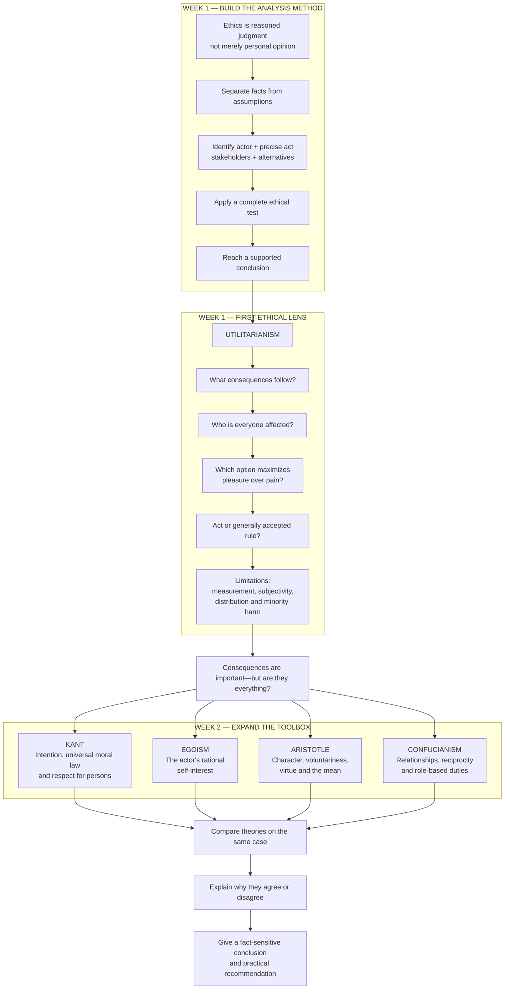

# How Week 2 Builds on Week 1

## Short answer

Week 2 builds on Week 1 **methodologically**, but its theories are not upgrades to utilitarianism. They are competing lenses added to the same ethical-analysis toolbox.

> **Interpretive note:** The slides do not expressly say that the Week 2 theories were designed to repair utilitarianism. The most defensible account of the sequence is pedagogical: Week 1 establishes the case-analysis method through utilitarianism, while Week 2 broadens the moral questions you can ask of the same facts.



## What is actually building up?

### Week 1 gives you the procedure

Week 1 teaches you to:

```text
identify the act
→ preserve the facts
→ identify affected parties
→ apply a theory
→ consider objections
→ conclude
```

Utilitarianism is the first full theory used to practise that procedure. It evaluates actions through their consequences for everyone. [W1, slides 44–76](<../week1/Ethics - Lecture Slides - Lecture One (1).pdf>)

### Week 2 keeps the procedure but changes the central moral question

Week 2 asks: **What if consequences are not the only morally important feature?**

```text
Same case
│
├─ Utilitarianism → What outcome maximizes welfare?
├─ Kant           → Was the act principled and respectful?
├─ Egoism         → Did it rationally advance the actor's interests?
├─ Aristotle      → What character or virtue did it express?
└─ Confucianism   → What relationships and reciprocal duties applied?
```

Week 2 does not discard Week 1's method. You still identify facts, apply every element, acknowledge uncertainty, and conclude. What changes is the theory's definition of morally relevant information.

## How each Week 2 theory contrasts with Week 1

### Utilitarianism → Kant

Week 1 exposes the possibility that aggregation might justify seriously harming one person for a larger total benefit.

Kant foregrounds:

- good intention;
- universal moral law;
- respect for each person as an end.

Kant can therefore reject an act even when it maximizes welfare. [W2, slides 3–15](<../week2/Ethics - Lecture Slides - Lecture Two (1).pdf>)

### Utilitarianism → Egoism

Utilitarianism says:

> Count everyone's welfare impartially.

Egoism asks:

> What rationally advances the actor's own interests?

This is a deliberate contrast, not necessarily an improvement. It demonstrates how radically the conclusion can change when the moral focus shifts from **everyone** to **the actor**. [W2, slides 16–28](<../week2/Ethics - Lecture Slides - Lecture Two (1).pdf>)

### Individual act → Aristotle

Act utilitarianism evaluates the consequences of a particular act. Aristotle shifts attention toward:

- whether the act was voluntary;
- what character trait it expressed;
- whether it represented deficiency, virtue, or excess;
- what kind of person the actor is becoming.

The central question changes from “Did this act maximize welfare?” to “Was this how a virtuous person would act in these circumstances?” [W2, slides 29–54](<../week2/Ethics - Lecture Slides - Lecture Two (1).pdf>)

### Abstract individuals → Confucian relationships

Utilitarianism counts individuals as bearers of welfare, while Kant applies universal duties to rational persons. Confucianism emphasizes that people occupy relationships—such as parent–child, ruler–subject, or employer–employee—with reciprocal responsibilities.

The question becomes:

> Did each person fulfil the duties associated with the relevant relationship?

[W2, slides 55–68](<../week2/Ethics - Lecture Slides - Lecture Two (1).pdf>)

## Best overall mental model

Do not imagine:

```text
Utilitarianism → Kant → Egoism → Aristotle → Confucianism
bad theory                                    final theory
```

Instead, imagine:

```text
                     Ethical problem
                           ↓
            ┌──────────────┼──────────────┐
            ↓              ↓              ↓
         Outcomes        Duties        Self-interest
            ↓              ↓              ↓
         Character ← Compare results → Relationships
                           ↓
                 Defensible conclusion
```

No later theory automatically replaces an earlier one. The lecturer explained that the theories are tools that can produce inconsistent answers; you must select relevant theories, apply them accurately, and defend your conclusion (Week 2 transcript, approximately 01:00:08–01:01:15).

## Exam implication

The intended progression is:

> **Week 1 teaches you how to perform ethical analysis through one major theory. Week 2 demonstrates that ethicality can be evaluated through several competing conceptions of what morally matters.**

For a hypothetical:

1. Preserve the facts and identify the precise ethical issue.
2. Select at least two theories that fit those facts, subject to the exact exam instructions.
3. Apply each theory's complete test independently.
4. Explain whether the theories agree and, crucially, whether they agree for different reasons.
5. If they disagree, identify the moral value causing the disagreement.
6. Reach a supported overall conclusion and practical recommendation.

Theories disagreeing is not a problem to hide. Explaining **why** they disagree is one of the clearest demonstrations that you understand what each theory treats as morally central.
