# Ethics & Social Responsibility: Weeks 1-3 Overview

## The course story in one minute

```text
WEEK 1: How do we reason ethically?
        Learn the case method and judge consequences through utilitarianism.

WEEK 2: What else can make an act right or wrong?
        Add intention and duty, self-interest, character, and relationships.

WEEK 3: Can we use those theories in messy real life?
        Apply them to coercion, public policy, sustainability, marketing,
        consumer choices, hidden supply chains, and future generations.
```

The weeks build a toolbox, not a ladder. Kant does not "replace" utilitarianism, and Aristotle does not "defeat" Kant. Each framework makes different features morally visible.

Sources: [Week 1 slides](<../week1/Ethics - Lecture Slides - Lecture One (1).pdf>) · [Week 2 slides](<../week2/Ethics - Lecture Slides - Lecture Two (1).pdf>) · [Week 3 slides](<../week3/Ethics - Lecture Slides - Lecture Three (1).pdf>) · [Detailed Weeks 1-2 guide](<week-01-02/ethics_weeks_1_2_study_guide.md>) · [Detailed Week 3 notes](<../week3/week3_notes.md>)

---

## 1. Week-by-week map

| Week | Central question | Main content | What you should be able to do |
|---|---|---|---|
| 1 | What makes ethical judgment reasoned rather than personal opinion? | Issue identification, facts versus assumptions, utilitarianism, act versus rule utility | identify a precise issue, map stakeholders and consequences, compare alternatives, and reach a supported conclusion |
| 2 | What morally matters besides consequences? | Kant, Machiavelli/Hobbes/Rand egoism, Aristotle, Confucianism | apply each theory's complete test and explain why theories agree or disagree |
| 3 | How do these theories work when choices have hidden and conflicting effects? | Maju Forest, Kim Bok-Dong, straws, cartons, tote bags, *The Good Place* | separate acts, evaluate life cycles and power, include indirect stakeholders, and make realistic recommendations |

---

# Week 1: Ethical reasoning and utilitarianism

## 2. Ethics is more than opinion

A **descriptive claim** tells us what is, was, or is likely to happen. We evaluate it using evidence and ask whether it is factually accurate.

A **normative claim** tells us what ought to happen or judges something as right, wrong, ethical, unfair, or morally required. We evaluate it using ethical reasons and values.

| Type | Question answered | Common signals | Example |
|---|---|---|---|
| Descriptive | What is happening? | is, was, causes, increases, will probably | "The carton contains several bonded materials and is difficult to recycle." |
| Normative | What ought to happen? | ought, should, right, wrong, ethical, unfair | "The company should explain the carton's recycling limitations." |

### Facts do not produce an ethical conclusion by themselves

To move from a descriptive fact to a normative conclusion, we usually need a **value premise** explaining why the fact matters:

```text
Descriptive premise:
The recycling label is likely to make consumers believe that the carton
can be fully and easily recycled.

Normative value premise:
Businesses ought not mislead consumers about information that affects
their choices.

Normative conclusion:
Therefore, the business ought not use the label without clearly explaining
the carton's recycling limitations.
```

The value premise is the bridge between **what is** and **what ought to be**. Without that bridge, the writer has reported a fact but has not explained its ethical significance.

### A common source of confusion

Some descriptive statements sound morally serious but remain descriptive:

- "The policy will harm 500 residents" is a prediction about consequences.
- "The government ought to avoid that harm" is a normative judgment.
- "Avoiding severe involuntary harm should take priority over minor convenience" is the value premise supporting that judgment.

Likewise, "most people approve of the policy" is descriptive. It does not by itself prove that the policy is ethical. Popularity tells us what people believe, not what they ought to believe.

> **Quick test:** Can evidence alone show whether the claim is true? It is probably descriptive. Does the claim require a judgment about what is right, valuable, or required? It is normative.

An ethical conclusion therefore needs more than "I feel it is wrong." It needs relevant facts, a defensible value or ethical principle, and reasoning connecting the two. [W1, slides 40-43](<../week1/Ethics - Lecture Slides - Lecture One (1).pdf>)

## 3. The general case method

```text
facts → precise ethical issue → actors and stakeholders → theory
      → counterargument/limitation → conclusion → recommendation
```

Preserve the hypothetical. If a fact is missing, state an assumption or analyze both possibilities.

### Decision flow: is the action ethical?

This diagram is a reasoning guide, not a machine that produces an automatic answer. A "situation" may contain several actors and actions, so do not label the whole situation ethical or unethical too early. Each lane applies one theory independently before the results converge.

```mermaid
flowchart TB
    A([Situation or action to assess]) --> B["Define one issue:<br/>Who did or omitted what?"]
    B --> C["Separate facts, inferences and assumptions;<br/>identify stakeholders and realistic alternatives"]

    C --> ULANE
    C --> KLANE
    C --> MLANE
    C --> HLANE
    C --> RLANE
    C --> ALANE
    C --> FLANE

    subgraph ULANE["Lane 1 - Utilitarianism"]
        direction LR
        U0["Choose act or rule utility"] --> U1["Act: assess this act<br/>Rule: assess general acceptance,<br/>then the act's conformity"]
        U1 --> U2["Identify everyone; compare pleasure,<br/>pain and feasible alternatives"]
        U2 --> U3{"Greatest net balance<br/>of welfare?"}
        U3 -- Yes --> UY["Utilitarian result:<br/>ETHICAL"]
        U3 -- No --> UN["Utilitarian result:<br/>UNETHICAL"]
        U3 -- "Even or unknowable" --> UX["Utilitarian result:<br/>MIXED or INDETERMINATE"]
    end

    subgraph KLANE["Lane 2 - Kantian ethics"]
        direction LR
        K0["State the actor's maxim;<br/>identify the intention"] --> K1["Test all three requirements:<br/>good intention + universalizability<br/>+ respect for persons"]
        K1 --> K2{"Are all three<br/>requirements satisfied?"}
        K2 -- Yes --> KY["Kantian result:<br/>ETHICAL"]
        K2 -- "Any requirement fails" --> KN["Kantian result:<br/>UNETHICAL"]
        K2 -- "Evidence missing and<br/>no decisive failure" --> KX["Kantian result:<br/>INDETERMINATE"]
    end

    subgraph MLANE["Lane 3 - Machiavelli egoism"]
        direction LR
        M0["Identify the actor and the<br/>power sought or protected"] --> M1["Consider short- and long-term<br/>effects on domination and power"]
        M1 --> M2{"Does the act acquire or maintain<br/>the power to dominate others?"}
        M2 -- Yes --> MY["Machiavelli result:<br/>ETHICAL"]
        M2 -- No --> MN["Machiavelli result:<br/>UNETHICAL"]
        M2 -- Unclear --> MX["Machiavelli result:<br/>INDETERMINATE"]
    end

    subgraph HLANE["Lane 4 - Hobbes egoism"]
        direction LR
        H0{"Does the act involve<br/>cooperation?"}
        H0 -- No --> HX["Hobbes result:<br/>WEAK FIT - do not force it"]
        H0 -- Yes --> H1["Identify how the cooperation affects<br/>the actor's own welfare and security"]
        H1 --> H2{"Is the cooperation in the<br/>actor's self-interest?"}
        H2 -- Yes --> HY["Hobbes result:<br/>ETHICAL"]
        H2 -- No --> HN["Hobbes result:<br/>UNETHICAL"]
        H2 -- Unclear --> HU["Hobbes result:<br/>INDETERMINATE"]
    end

    subgraph RLANE["Lane 5 - Rand egoism"]
        direction LR
        R0["Identify the actor's claimed<br/>self-interest"] --> R1["Test rationality, voluntariness,<br/>absence of coercion and long-term<br/>life or happiness"]
        R1 --> R2{"Are the relevant requirements<br/>satisfied?"}
        R2 -- Yes --> RY["Rand result:<br/>ETHICAL"]
        R2 -- "Any requirement fails" --> RN["Rand result:<br/>UNETHICAL"]
        R2 -- Unclear --> RX["Rand result:<br/>INDETERMINATE"]
    end

    subgraph ALANE["Lane 6 - Aristotelian virtue ethics"]
        direction LR
        A0{"Was the act<br/>voluntary?"}
        A0 -- No --> AX["Do not judge the actor vicious;<br/>the act is not thereby ethical"]
        A0 -- Unclear --> AU["Aristotle result:<br/>INDETERMINATE"]
        A0 -- Yes --> A1["Identify the relevant virtue;<br/>state its deficiency and excess"]
        A1 --> A2{"Does the act express the<br/>rational, context-sensitive mean?"}
        A2 -- Yes --> AY["Aristotle result:<br/>ETHICAL or VIRTUOUS"]
        A2 -- No --> AN["Aristotle result:<br/>UNETHICAL or VICIOUS"]
        A2 -- Unclear --> AA["Aristotle result:<br/>INDETERMINATE"]
    end

    subgraph FLANE["Lane 7 - Confucianism"]
        direction LR
        F0{"Is there a listed relationship<br/>or a justified analogy?"}
        F0 -- No --> FX["Confucian result:<br/>WEAK FIT - do not force it"]
        F0 -- Yes --> F1["Identify both sides' reciprocal duties;<br/>consider virtue and public good"]
        F1 --> F2{"Were the relevant duties<br/>fulfilled?"}
        F2 -- Yes --> FY["Confucian result:<br/>ETHICAL"]
        F2 -- No --> FN["Confucian result:<br/>UNETHICAL"]
        F2 -- Unclear --> FU["Confucian result:<br/>INDETERMINATE"]
    end

    ULANE --> CV0
    KLANE --> CV0
    MLANE --> CV0
    HLANE --> CV0
    RLANE --> CV0
    ALANE --> CV0
    FLANE --> CV0

    subgraph CONVERGE["Convergence - reach the best-supported overall judgment"]
        direction TB
        CV0["Record each lane's conclusion<br/>and the reason supporting it"] --> CV1["Relevance screen:<br/>give more weight to theories that directly<br/>address the case; discount weak-fit lanes"]
        CV1 --> CV2["Evidence screen:<br/>check whether each doctrine was completed<br/>and how reliable its key facts are"]
        CV2 --> CV3{"Enough evidence for an<br/>overall judgment?"}
        CV3 -- No --> IND["INDETERMINATE:<br/>state the missing evidence and<br/>give conditional conclusions"]
        CV3 -- Yes --> CV4{"Do the strongest and most<br/>relevant lanes agree?"}
        CV4 -- Yes --> CV5["Convergence strengthens the conclusion;<br/>explain their different reasons"]
        CV4 -- No --> CV6["Identify the value conflict:<br/>outcomes, dignity, power, self-interest,<br/>character or relational duty"]
        CV5 --> CV7["Weigh reasons, not votes:<br/>consider severity, scope, consent, power,<br/>reversibility, long-term effects and uncertainty"]
        CV6 --> CV7
        CV7 --> CV8{"Which direction has the<br/>most compelling reasons?"}
    end

    CV8 -- Ethical --> ES{"How strong is the<br/>ethical justification?"}
    CV8 -- "Genuinely balanced" --> MIX["NEITHER CLEARLY ETHICAL NOR UNETHICAL:<br/>the known reasons remain evenly balanced"]
    CV8 -- Unethical --> US{"How serious and decisive is the<br/>ethical failure?"}

    ES -- "All relevant tests pass;<br/>no serious unresolved objection" --> EO["ETHICAL OUTRIGHT"]
    ES -- "Strong support;<br/>only limited concerns" --> EL["ETHICAL TO A LARGE EXTENT"]
    ES -- "Some support;<br/>major reservations remain" --> EP["ETHICAL TO A SMALL EXTENT"]

    US -- "Grave, clear and unjustifiable breach;<br/>no credible defence" --> UO["UNETHICAL OUTRIGHT"]
    US -- "Strong or serious failures;<br/>only limited mitigation" --> UL["UNETHICAL TO A LARGE EXTENT"]
    US -- "Limited failure;<br/>substantial mitigation" --> UP["UNETHICAL TO A SMALL EXTENT"]

    IND --> EX["Explain the classification,<br/>decisive reasons and remaining uncertainty"]
    MIX --> EX
    EO --> EX
    EL --> EX
    EP --> EX
    UO --> EX
    UL --> EX
    UP --> EX

    EX --> Q["Recommend the next step:<br/>obtain missing evidence, or repair<br/>and prevent the ethical problem"]
    Q --> Z([Completed ethical analysis])
```



### Best way to converge the theory lanes

Do **not** decide by counting how many theories say "ethical" and how many say "unethical." The theories ask different questions, and some fit a case much better than others. Converge in this order:

1. **Relevance:** Which theories directly address the case's central facts? For example, Kant is highly relevant to coercion, while Hobbes may be a weak fit when there is no cooperation.
2. **Completeness:** Was every element of each selected doctrine applied, or is the result based on only one convenient part?
3. **Evidence:** How certain are the consequences, intentions, voluntariness, relationships, and claims about self-interest?
4. **Moral seriousness:** Consider the severity and extent of harm, consent, dignity, power imbalance, distribution, reversibility, and long-term effects.
5. **Counterargument:** Does the conclusion survive the strongest opposing interpretation and a theory-specific limitation?
6. **Residual uncertainty:** Decide whether the evidence supports a graded conclusion, a genuinely mixed judgment, or only an indeterminate result.

The overall conclusion should therefore follow the **most relevant and compelling reasons**, not the largest number of theory labels.

The course does not supply a mathematical formula for weighting theories. This convergence method is a reasoned synthesis: state which considerations you treat as decisive and justify that choice openly.

### How to choose the final classification

| Classification | When to use it |
|---|---|
| **Ethical outright** | The complete tests of the most relevant theories are satisfied, the evidence is strong, and no serious objection remains. |
| **Ethical to a large extent** | Ethical reasons clearly predominate, although limited harms, failures, or uncertainty remain. |
| **Ethical to a small extent** | Ethical reasons only slightly predominate and major reservations remain. |
| **Neither clearly ethical nor unethical** | The competing ethical reasons remain genuinely balanced even though the important facts are known. |
| **Indeterminate on the available facts** | The conclusion depends on missing evidence, such as the actor's intention, the severity of harm, or whether consent was genuine. |
| **Unethical to a small extent** | Unethical reasons slightly predominate, but the failure is limited or substantially mitigated. |
| **Unethical to a large extent** | Serious ethical failures clearly predominate, although some meaningful justification or mitigation remains. |
| **Unethical outright** | The act involves a grave and unjustifiable failure, such as severe coercion or treating persons merely as means, with no credible defence on the facts. |

**Mixed** and **indeterminate** are not the same. A mixed judgment means you know the important facts but the ethical reasons remain balanced. An indeterminate judgment means important facts are missing, so you cannot yet weigh the reasons reliably.

These labels are not numerical percentages. "Ethical to a large extent" means the ethical reasons are substantially more compelling after applying the relevant theories, not that the action is mathematically, for example, 80% ethical.

Ethical theories can reasonably disagree. A strong answer identifies the disagreement, explains which values cause it, and states why one classification is ultimately the most persuasive.

## 4. Utilitarianism

> An action is right if and only if it produces the greatest balance of pleasure over pain for everyone.

Its four linked features are:

| Feature | Meaning |
|---|---|
| Consequentialism | judge the action by what it causes |
| Hedonism | pleasure is the good and pain counts against it |
| Maximalism | choose the greatest net balance among feasible alternatives |
| Universalism | count everyone impartially, not only the actor |

[W1, slides 44-54](<../week1/Ethics - Lecture Slides - Lecture One (1).pdf>)

### Act versus rule utilitarianism

| | Act utilitarianism | Rule utilitarianism |
|---|---|---|
| Main question | Which action creates the most welfare in this particular situation? | Which general rule would create the most welfare if people generally followed it? |
| What is judged? | The individual action | The general rule first, followed by whether the action conforms to it |
| Treatment of exceptions | An unusual situation can directly justify an exception | An exception should be included in a rule that applies to all relevantly similar cases |
| Main risk | It can justify dangerous one-off exceptions when the immediate payoff looks positive | Rules can become too rigid or be worded strategically to produce a preferred answer |

**Example: Nick runs a red light during an emergency.**

- **Act utilitarianism:** Did running the light in this particular situation produce more benefit than harm? If Nick safely rushed an injured person to hospital, the act might be ethical.
- **Rule utilitarianism:** Which generally accepted rule creates the best consequences? "Anyone may run red lights whenever they want" would cause serious harm. "Emergency vehicles may proceed through red lights with proper precautions" may produce greater welfare. Nick's action is then judged by whether it conforms to the best rule.

The easiest way to remember the distinction is:

> **Act utilitarianism judges the particular case directly. Rule utilitarianism asks what rule should govern all relevantly similar cases.**

Neither version is automatically better. Choose the one that fits the facts. [W1, slides 55-74](<../week1/Ethics - Lecture Slides - Lecture One (1).pdf>)

### Main limitations

- Who counts as "everyone"?
- How can unlike pleasures and pains be measured?
- How much weight should uncertain future consequences receive?
- Can benefits to many justify devastating harm to a minority?
- How should distribution and irreversibility affect the total?

---

# Week 2: Competing ethical lenses

## 5. Kantian ethics

> An action is right if it is done with good intentions and satisfies the two categorical imperatives: universalizability and respect for persons.

```text
1. Good intention
2. Could the maxim be a universal moral law without contradiction?
3. Does the act respect persons as ends, rather than use them merely as means?
```

All three parts should be analyzed. A rational or effective action is not automatically moral. Kant is especially useful for deception, coercion, consent, double standards, and dignity. [W2, slides 3-15](<../week2/Ethics - Lecture Slides - Lecture Two (1).pdf>)

Main limitations: intentions are difficult to know, duties can conflict, and the framework does not directly weigh costs and benefits.

## 6. Ethical egoism

Ethical egoism is normative: it says people **ought** to act in self-interested ways. It does not merely observe that people often do so.

| Strand | Course doctrine | Key question |
|---|---|---|
| Machiavelli | an act is right if done to dominate or maintain the power to dominate others | does it gain or preserve power, including in the long term? |
| Hobbes | cooperation is right when it is in the actor's self-interest | does cooperation protect the actor's welfare and social order? |
| Ayn Rand | an act is right when it rationally advances one's self-interest | is it rational, voluntary, uncoerced, and supportive of long-term life and happiness? |

[W2, slides 16-28](<../week2/Ethics - Lecture Slides - Lecture Two (1).pdf>)

Helping others can fit egoism when doing so advances power, mutually beneficial cooperation, or rational long-term happiness.

## 7. Aristotelian virtue ethics

Aristotle changes the question from "What rule or result?" to:

> What character does this voluntary action express, and does it embody the relevant virtue in the right measure?

Application sequence:

```text
voluntary act?
      ↓
relevant virtue or vice
      ↓
deficiency ← context-sensitive mean → excess
      ↓
rational justification and effect on flourishing
```

The mean is not a mathematical average. Courage, for example, lies between cowardice and rashness, but what courage requires depends on the circumstances. [W2, slides 29-54](<../week2/Ethics - Lecture Slides - Lecture Two (1).pdf>)

Main limitation: Aristotle does not give a precise formula for locating the mean. A writer must justify it.

## 8. Confucianism

Confucianism emphasizes relationships, reciprocal duties, hierarchy, cultivation of virtue, and public good.

The five relationships presented in the course are:

1. parent-child;
2. husband-wife;
3. elder-younger sibling;
4. ruler-subject or master-servant; and
5. elder-younger friend.

The negative golden rule is:

> Do not do unto others what you do not want others to do unto you.

Reciprocity does not mean equality, but it does mean duties exist on both sides. When applying Confucianism to employer-employee relations, expressly say that it is an analogy to master-servant or ruler-subject and explain why. Business is not condemned, but profit cannot be its sole aim. [W2, slides 55-68](<../week2/Ethics - Lecture Slides - Lecture Two (1).pdf>)

Main limitation: hierarchy and the weak doctrine of individual rights may inadequately protect vulnerable people.

---

# Week 3: Application under complexity

## 9. No simple "green = good" shortcut

Week 3 shows why environmental choices require full analysis:

- plastic straws persist, but substitutes also have costs and accessibility implications;
- cartons may look recyclable while containing bonded materials that few facilities can process;
- cotton totes are reusable, but production can be resource-intensive and repeated acquisition creates waste; and
- ordinary purchases carry indirect effects through labour, transport, energy, packaging, and disposal.

[W3, slides 8-24](<../week3/Ethics - Lecture Slides - Lecture Three (1).pdf>)

The right question is comparative:

> Which realistic option, under the expected pattern of production, use, reuse, and disposal, is most ethically defensible?

## 10. Week 3's four biggest reasoning lessons

### Separate related acts

Using a tote, acquiring a tote, refusing a plastic bag, distributing branded totes, and advertising them as sustainable are different acts.

### Good intention is only one consideration

A sustainability campaign may have good intentions but bad results, a non-universalizable practice, misleading communication, or self-interested motives.

### Hidden consequences still matter

Under utilitarianism, ignorance does not delete a consequence. Under Kant or Aristotle, however, knowledge can affect intention, voluntariness, and blame.

### Perfect purity may be impossible

The *Good Place* illustrates that a simple purchase can contain many unseen choices. This does not mean "anything goes." It means responsibility should be informed, proportionate, and shared with institutions that have greater knowledge and power.

---

## 11. All theories on one page

| Lens | Core question | Best factual triggers | What it may neglect |
|---|---|---|---|
| Utilitarianism | Which option maximizes net welfare for everyone? | harms, benefits, risk, policy alternatives, future effects | dignity, rights, distribution, measurement problems |
| Kant | Is the act well-intentioned, universalizable, and respectful of persons? | deception, coercion, consent, double standards | outcome trade-offs; uncertain intentions |
| Machiavelli | Does it acquire or preserve power? | domination, influence, legitimacy | the welfare and dignity of others |
| Hobbes | Is cooperation in the actor's self-interest? | contracts, coordination, order, mutual benefit | coerced or unequal "cooperation" |
| Rand | Does it rationally and voluntarily advance long-term self-interest? | choice, coercion, life, long-term flourishing | collective-action and public-goods problems |
| Aristotle | Does the voluntary act express a virtue in the contextual mean? | character, habit, moderation, courage, duress | precise action rules and outcome calculation |
| Confucianism | Were reciprocal duties within the relationship fulfilled? | family, hierarchy, leadership, employment, public good | individual rights and outsiders to the relationship |

---

## 12. One Week 3 case through the whole toolbox

**Issue:** Whether a drink company acts ethically by placing a prominent "recyclable" label on a carton that local facilities rarely process.

- **Utilitarianism:** compare additional sales and possible diversion from worse packaging against consumer confusion, contamination of recycling streams, waste, and loss of trust.
- **Kant:** a foreseeably misleading label may use consumers merely as means to sales and may fail a universal rule of transparent sustainability claims.
- **Machiavelli:** the label may build market power in the short term but destroy reputation and regulatory influence later.
- **Hobbes:** reliable labels support beneficial cooperation among firms, consumers, and recycling systems; misleading claims weaken it.
- **Rand:** deception can prevent voluntary, informed consumer choice and may be irrational for long-term business interests.
- **Aristotle:** the conduct tests honesty, moderation, responsibility, and practical wisdom.
- **Confucianism:** a business pursuing profit without reciprocal concern for consumers and public good acts unethically under the course framework.

Notice that several theories can agree that the label is wrong while giving different reasons. Explaining those reasons shows more understanding than merely listing the theories.

---

## 13. Exam-ready workflow

For every selected issue:

1. Write the issue as **actor + precise act or omission**.
2. Separate stated facts from inference and assumption.
3. Select at least two theories that genuinely fit, subject to the exam instructions.
4. State each course doctrine accurately.
5. Apply every element of that doctrine.
6. Give the strongest counterargument.
7. Add one fact-specific limitation.
8. Reach a qualified but clear conclusion.
9. Recommend a realistic change that repairs the ethical failure.

### Compact paragraph template

```text
Issue: Whether [actor]'s act of [conduct] was ethical.

Doctrine: [Exact course rule.]

Application: [Element → fact → significance.] The strongest opposing
argument is [...]. A missing or uncertain fact is [...].

Limitation: This theory has difficulty with [...] in this case because [...].

Conclusion: Therefore, under [theory], the act is likely [ethical/unethical].

Recommendation: [Specific action], which would [reduce harm/respect autonomy/
cultivate virtue/fulfil reciprocal duty/etc.].
```

---

## 14. High-yield distinctions

| Do not confuse... | Correct distinction |
|---|---|
| descriptive and normative claims | what happens is different from what ought to happen |
| act and rule utilitarianism | one judges the particular act; the other first tests a generally accepted rule |
| good intention and ethical action under Kant | intention is necessary in the course doctrine but not sufficient |
| rational and moral | Kant says not every rational act is moral |
| ethical and psychological egoism | "ought to pursue self-interest" differs from "people naturally do so" |
| self-interest and selfish isolation | egoists may help or cooperate when it serves their interest |
| Aristotle's mean and an average | the mean is contextual and rationally justified |
| reciprocity and equality | Confucian roles can be unequal while imposing duties on both sides |
| recyclable in theory and recycled in practice | actual materials, facilities, behaviour, and end products matter |
| using and acquiring a reusable product | reuse may reduce waste; repeated acquisition creates new impacts |
| legality and ethics | legal permission does not by itself make conduct ethical |

---

## 15. Final memory sheet

```text
UTILITARIANISM = outcomes for everyone
KANT           = intention + universal law + respect
MACHIAVELLI    = power
HOBBES         = self-interested cooperation
RAND           = rational, voluntary, long-term self-interest
ARISTOTLE      = voluntary character + contextual mean
CONFUCIANISM   = relationships + reciprocal duties + public good

WEEK 3 ADDS:
separate acts + life cycle + realistic alternatives + hidden effects
+ future generations + power + uncertainty + practical repair
```

## Bottom line

Week 1 teaches a disciplined method through consequences. Week 2 expands the moral field to duty, power, self-interest, character, and relationships. Week 3 shows why mature ethical judgment needs those lenses together: real choices rarely have a harmless option, a complete dataset, or a trustworthy label.
