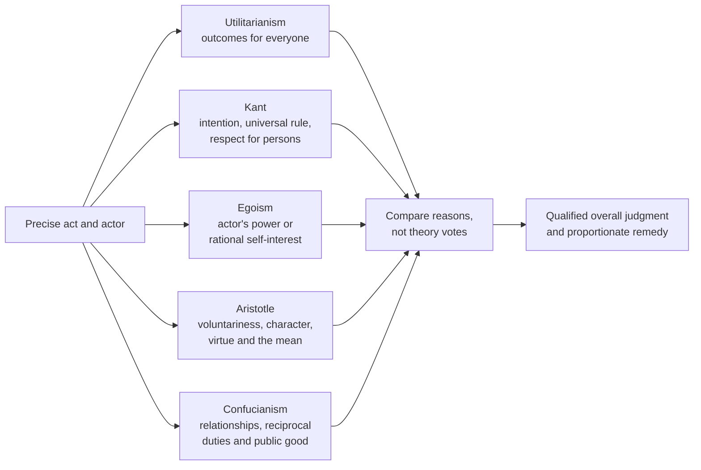

# Ethics & Social Responsibility: Weeks 1–5 Overview

## The whole course so far in 30 seconds

```text
Week 1  → Build an ethical argument; learn utilitarianism.
Week 2  → Add duty, self-interest, character, and relationships.
Week 3  → Apply the theories to coercion and environmental choices.
Week 4  → Examine persuasion, ambiguity, competition, and manipulation.
Week 5  → Allocate responsibility for digital exploitation and AI.
```

The theories are different lenses, not stages in which one replaces another. A strong answer identifies the precise act, applies the most relevant lenses, compares their reasons, and reaches a qualified conclusion.

### Source and study-note links

- [Detailed Weeks 1–2 study guide](<week-01-02/ethics_weeks_1_2_study_guide.md>)
- [Detailed Week 3 notes](<../week3/week3_notes.md>)
- [Detailed Week 4 notes](<../week4/week4_notes.md>)
- [Detailed Week 5 notes](<../week5/week5_notes.md>)
- [Weeks 1–3 overview with the full theory-lane Mermaid diagram](<course-overview-weeks-01-03.md>)

The Week 4 ethics notes use both the lecture slides and the auto-generated Zoom transcript; the slides control where transcription is unclear. Week 5 uses the slides only because no transcript was supplied. Week 5's worked applications are therefore reasoned study guidance, not transcript-confirmed model answers.

---

## 1. The reasoning foundation

### Descriptive versus normative claims

| Type | What it does | How to test it | Example |
|---|---|---|---|
| **Descriptive** | states what is, was, or will probably happen | evidence and factual accuracy | “The advertisement caused many complaints.” |
| **Normative** | judges what is right, wrong, fair, or required | ethical reasons and values | “The company ought to withdraw the advertisement.” |

A descriptive fact does not produce a normative conclusion by itself. It needs a value bridge:

```text
Fact:       The scarcity message is false and pressures consumers.
Principle:  Businesses ought not manipulate choices through false information.
Conclusion: The business ought not use that message.
```

“Most people approve” is still descriptive. Popularity does not prove ethical correctness.

### The basic case method

1. **Frame one precise issue:** whether a named actor acted ethically by doing or omitting a named act.
2. **Separate facts, inferences, and assumptions.** State what evidence is missing.
3. **Identify stakeholders:** include indirect, vulnerable, and future parties where relevant.
4. **Compare realistic alternatives:** ethics is rarely a choice between the act and doing nothing.
5. **Apply the most relevant theories completely.** Do not force weak fits.
6. **Answer the strongest objection.** Explain why it succeeds or fails.
7. **Conclude with degree and confidence.** State what could change the judgment.
8. **Recommend a proportionate response.** Connect it to the cause of the problem.

---

## 2. The ethical theories on one page

| Theory | Core question | Complete test | Common mistake |
|---|---|---|---|
| **Act utilitarianism** | Does this act create the greatest overall welfare in these circumstances? | count everyone; compare benefits, harms, likelihood, intensity, duration, and alternatives | counting only the actor or the majority |
| **Rule utilitarianism** | Would general acceptance of the best rule maximize welfare, and does this act follow it? | compare workable general rules first; select the welfare-maximizing rule; test the act against it | inventing a narrow rule that names the actor or exception |
| **Kantian ethics** | Is the act done from a good intention, universalizable, and respectful of persons? | satisfy all three requirements | discussing intention alone |
| **Machiavelli egoism** | Does it acquire or preserve the actor's power to dominate? | identify actor, relevant power, and short- and long-term effects | treating immediate attention as lasting power |
| **Hobbes egoism** | Is cooperation in the actor's self-interest? | identify genuine cooperation and its effect on security or welfare | calling collusion or coercion ethical cooperation |
| **Rand egoism** | Does it rationally and voluntarily advance long-term self-interest? | rationality, long-term life or happiness, voluntariness, and absence of coercion | treating any desire or whim as self-interest |
| **Aristotle** | Does a voluntary act express the context-sensitive virtuous mean? | voluntariness; relevant virtue; deficiency and excess; justified mean | calling any compromise “the mean” |
| **Confucianism** | Does the act fulfil reciprocal relational duties and promote humane public good? | identify a listed relationship or justified analogy; analyze both sides' duties | inventing a modern relationship without explaining the analogy |

### Act versus rule utilitarianism in plain language

Suppose a driver considers running a red light:

- **Act utilitarianism:** Would running this light, in these exact circumstances, produce more total benefit than harm compared with the alternatives?
- **Rule utilitarianism:** Which generally accepted traffic rule would produce the most welfare—“drivers may run red lights when convenient” or “drivers must stop, except under tightly defined emergency rules”? Then ask whether this act follows the best rule.

Rule utilitarianism is not simply “follow whatever rule already exists.” The rule is justified by the consequences of its **general acceptance**.

---

## 3. How the theories differ



For the granular lane-by-lane decision tree, see the [Weeks 1–3 overview](<course-overview-weeks-01-03.md>).

### How to converge without “majority voting”

If four theories say “unethical” and one says “ethical,” do not simply count 4–1. Instead ask:

1. **Fit:** Which theories directly address the case?
2. **Completeness:** Were all required parts of each theory applied?
3. **Evidence:** How reliable are the facts supporting each result?
4. **Moral seriousness:** Are dignity, coercion, grave harm, or irreversible loss involved?
5. **Alternatives:** Could the benefit be preserved through a less harmful option?
6. **Residual concern:** What objection remains even after the best argument?

Use this conclusion scale:

| Classification | When to use it |
|---|---|
| **Ethical outright** | all strong, relevant tests support the act and no serious objection remains |
| **Ethical to a large extent** | strong support with limited concerns |
| **Ethical to a small extent** | some justification, but major reservations remain |
| **Neither clearly ethical nor unethical** | known reasons remain genuinely balanced |
| **Indeterminate** | decisive facts are missing; give conditional conclusions |
| **Unethical to a small extent** | a limited failure with substantial mitigation |
| **Unethical to a large extent** | serious or multiple failures with limited mitigation |
| **Unethical outright** | grave, clear, unjustifiable failure with no credible defence |

---

## 4. Week-by-week map

| Week | Central question | Main material | Transferable skill |
|---|---|---|---|
| **1** | What makes an ethical judgment reasoned rather than personal opinion? | normative/descriptive reasoning; stakeholders; act and rule utilitarianism | move from facts through an ethical principle to a supported conclusion |
| **2** | What morally matters besides consequences? | Kant; Machiavelli, Hobbes, and Rand; Aristotle; Confucianism | apply each theory's full doctrine and explain disagreement |
| **3** | How do theories work when impacts are hidden and choices imperfect? | Maju Forest; Kim Bok-Dong; straws, cartons, tote bags; *The Good Place* | separate acts, use life-cycle reasoning, and include future or indirect stakeholders |
| **4** | When does persuasion become manipulation? | deceptive livestream selling, controversial advertisements, competition, ragebait, green claims, consultants, dark patterns | judge overall impression, ambiguity, intention, and audience vulnerability |
| **5** | Who is responsible when technology scales influence or harm? | Nth Room; AI in court; Bue and Billie; Ghibli-style AI | separate design, deployment, use, verification, causation, and safeguards |

---

# Week 1: Ethical reasoning and consequences

## 5. Utilitarianism

Utilitarianism is consequentialist: an act or rule is judged by its effects on overall pleasure, welfare, or happiness and pain or harm.

### A practical utility analysis

1. Identify all affected groups, including future and indirect stakeholders.
2. List benefits and harms for each group.
3. Assess likelihood, intensity, duration, scale, reversibility, and distribution.
4. Compare realistic alternatives.
5. Explain which option has the greatest **net** welfare.

Numbers can assist, but false precision should not replace judgment. A small convenience for thousands does not automatically outweigh severe harm to a few.

### Main limitations

- consequences can be uncertain;
- benefits and harms are difficult to compare;
- the majority's welfare may sacrifice a minority;
- act utilitarianism may permit troubling exceptions;
- rule utilitarianism may become rigid or be manipulated by rule wording.

---

# Week 2: Duty, self-interest, character, and relationships

## 6. Kantian ethics

The course test is conjunctive:

```text
good intention
AND a maxim that can be universalized
AND respect for every person as an end
```

A useful maxim has the form: “When I am in circumstance C, I will do action A to achieve purpose P.” Ask whether everyone could act on it without contradiction and whether anyone is deceived, coerced, or reduced to a tool.

Good consequences do not rescue a maxim that fundamentally disrespects persons. Equally, a claimed good intention does not excuse a failure of universalizability or dignity.

## 7. Ethical egoism

Egoism asks what serves the actor, but its three versions are not interchangeable:

- **Machiavelli:** power and domination. Short-term provocation can be unethical under his own test if it destroys long-term control.
- **Hobbes:** self-interested cooperation. Stable common rules can protect each person's security better than unrestrained conflict.
- **Rand:** rational, voluntary, long-term flourishing. A coerced, reckless, or self-destructive whim is not automatically rational self-interest.

An egoist may help others, but the ethical reason is the actor's own interest rather than impartial welfare.

## 8. Aristotle's virtue ethics

Start with voluntariness. Then identify the relevant virtue and its two vices:

```text
deficiency ← virtuous, context-sensitive mean → excess
```

For example, courage may lie between cowardice and rashness. The mean is not always a midpoint or compromise; it is what practical wisdom judges appropriate to the circumstances. Repeated choices cultivate character, and a flourishing life is broader than wealth or momentary pleasure.

## 9. Confucianism

Confucian ethics emphasizes social relationships, cultivated virtue, harmony, and reciprocal duties. The five central relationships taught in the course are ruler–subject, father–son, husband–wife, elder–younger, and friend–friend.

For modern cases, say explicitly when a relationship is an analogy—for example, employer–employee may resemble ruler–subject or master–servant—and explain the limits. Duties run both ways: authority does not justify unconditional obedience. A main criticism is that harmony and role-duty may insufficiently protect individual rights or conceal wrongdoing through family loyalty.

---

# Week 3: Environmental ethics and complex systems

## 10. The key move: examine the full life cycle

```text
raw materials → production → transport → use/reuse → disposal → recycling
```

“Reusable,” “recyclable,” “natural,” and “plastic-free” do not settle the ethics. Compare the product with realistic alternatives and actual patterns of use.

### Major cases and lessons

- **Maju Forest:** balance housing and development benefits against biodiversity, cooling, community, future generations, and irreversibility. Consultation must be meaningful rather than performative.
- **Kim Bok-Dong:** separate the wartime government, individual participants, survivors, and later governments. Coercive sexual exploitation violates dignity and produces grave, enduring harm; later acknowledgment and repair are distinct ethical issues.
- **Straws:** a visible symbolic item may matter, but focusing only on it can distract from larger packaging impacts.
- **Drink cartons:** technical recyclability differs from realistic local recycling; overall impressions and omissions matter.
- **Tote bags:** reuse can lower per-use impact, but repeatedly buying “reusable” bags may defeat the purpose.
- **The Good Place:** complex supply chains make perfect purity difficult, but difficulty does not erase the duty to improve choices and institutions.

### Week 3 reasoning habits

- Separate the acts instead of judging a whole country, company, or product.
- Count hidden consequences even when the actor did not know them; ignorance may affect intention, but the effect still exists.
- Include future generations when current choices predictably affect them.
- Treat irreversibility as morally important.
- Do not call every compromise the Aristotelian mean.

---

# Week 4: Advertising, persuasion, and business influence

## 11. Literal truth versus overall impression

An advertisement can avoid an explicit falsehood yet still mislead through images, ambiguity, exaggeration, omission, placement, or artificial urgency.

Ask:

1. What was literally said?
2. What would a reasonable audience understand?
3. Was an alternative interpretation foreseeable?
4. Did the advertiser exploit attention, emotion, uncertainty, or trust?
5. Was a qualification prominent enough to correct the main impression?

### Main cases

| Case | Central issue | High-value distinction |
|---|---|---|
| TikTok livestream selling | false scarcity, exaggerated claims, and emotional pressure | harmless puffery differs from false facts that interfere with rational choice |
| Swatch pose | racial stereotyping and response | intention is not identical to foreseeable impact |
| American Eagle “jeans/genes” | wordplay and disputed implication | ambiguity can attract attention while preserving deniability |
| Gap campaign | ethics of competition | fair rivalry can benefit consumers; degradation and deception do not |
| Ragebait | anger used for engagement | truthful moral urgency differs from manufactured outrage |
| PRISM+ air-conditioning claim | humour and environmental exaggeration | calling a claim satire does not automatically prevent deception |
| iTea “zero” claim | what exactly “zero” modifies | a narrow technical truth may create a misleading overall impression |
| McKinsey/HBO | advice, expertise, and accountability | judge consultant and client decisions separately |
| Scarcity dark pattern | pressure through “running low” messages | genuine stock information differs from fabricated urgency |

### Strong Week 4 analysis

Combine:

- **Kant:** deception, universalizability, and consumer autonomy;
- **Utilitarianism:** sales or entertainment versus harm, polarization, waste, and lost trust;
- **Aristotle:** honesty, sensitivity, restraint, courage, and practical wisdom;
- **Egoism:** attention may serve short-term interest but destroy reputation or power;
- **Confucianism:** business should contribute to humane public good, not profit alone.

---

# Week 5: Digital exploitation and AI responsibility

## 12. Responsibility across a technological chain

```text
developer → company/deployer → user/professional → institution → regulator
```

Responsibility may be shared but unequal. Ask who had knowledge, control, capacity to prevent harm, and a duty to verify or protect.

### Main cases

| Case | Core ethical issue | Most important lesson |
|---|---|---|
| Nth Room | digitally scaled coercion and exploitation | online anonymity does not erase consent, dignity, or participation in harm |
| AI in court | fabricated or unverified authority | verification duties increase with stakes; assistance differs from unaccountable reliance |
| Bue and Billie | deceptive AI identity and vulnerable-user safety | trace causation carefully and assess foreseeable risk and safeguards |
| Ghibli-style AI | imitation, creative work, disclosure, and regulation | distinguish private experimentation, labelled sharing, passing-off, and commercial substitution |

### Four questions for any AI case

1. **Capability:** What can the system do?
2. **Use:** What did this actor choose to do with it?
3. **Safeguards:** Which foreseeable harms could reasonably have been reduced?
4. **Allocation:** Which user, developer, company, professional, or institution controlled each decision?

Avoid “the AI caused it” as a complete explanation. Build the causal chain, identify intervening decisions, and distinguish moral blame from mere causal contribution.

---

## 13. Connections across Weeks 3–5

| Recurring idea | Week 3 | Week 4 | Week 5 |
|---|---|---|---|
| Hidden effects | supply chains and product life cycles | implied messages and omitted qualifications | system behaviour, data, and indirect risk |
| Vulnerability | coerced victims, future generations | consumers and represented groups | exploited persons, litigants, older or dependent users, artists |
| Power | government and corporate decisions | advertiser, consultant, platform | developer, deployer, professional, institution |
| Truth | environmental labels | ambiguity, satire, scarcity | AI identity, fabricated authority, authentic authorship |
| Alternatives | different products and development plans | clearer claims and less manipulative campaigns | verification, disclosure, refusal rules, licensing, human review |
| Long-term effects | irreversible ecology | reputation and public trust | dependency, justice, creative markets, platform trust |

The common pattern is:

> The more power an actor has to shape another person's options, beliefs, or exposure to risk, the stronger the need for honesty, foresight, justification, and safeguards.

---

## 14. One integrated example

### Hypothetical

An AI companion presents itself as a real local person, encourages a lonely older user to meet, and increases engagement for the company.

| Lens | Application |
|---|---|
| Act utilitarianism | companionship and engagement must be weighed against deception, dependency, family distress, and physical risk; a clearly disclosed safer companion is a better alternative |
| Rule utilitarianism | a general rule allowing companions to claim human identity would undermine trust and expose many users to risk |
| Kant | false identity may manipulate the user and treat them as a means to engagement; the maxim is difficult to universalize |
| Machiavelli | engagement may create short-term platform power, but scandal and regulation may destroy long-term influence |
| Hobbes | shared safety standards may protect the company and users better than an unregulated race for engagement |
| Rand | the company's foreseeable long-term losses and the user's action on false information undermine rational self-interest |
| Aristotle | deceptive design lacks honesty and practical wisdom; family action should balance compassionate care against controlling paternalism |
| Confucianism | family and authorities have reciprocal care duties, while the company should contribute to public good rather than profit alone |

**Convergence:** the strongest lenses object to the deception and unmanaged foreseeable risk, not to companionship itself. The deployment is likely unethical to a large extent; clear identity disclosure and risk-sensitive safeguards could preserve much of the benefit.

---

## 15. Exam-ready writing template

### Issue

> Whether **[actor]** acted ethically by **[precise act or omission]**.

### Rule

Define every part of the selected theory accurately.

### Application

Connect each element of the rule to a concrete fact. Identify stakeholders, power, consent, effects, uncertainty, and alternatives.

### Counterargument

Present the strongest opposing reason fairly, then answer it.

### Conclusion

> Overall, the act was **[classification]** because **[decisive reasons]**. This judgment would change if **[material missing fact]**.

### Recommendation

State who should do what and why the measure is proportionate.

### Compact paragraph model

> Under **[theory]**, conduct is ethical when **[complete doctrine]**. Here, **[specific fact]** indicates **[application]**. A counterargument is **[strong objection]**; however, **[reply or limitation]**. Therefore, this theory judges the act **[result and degree]**.

---

## 16. Final checklist

Before submitting, ask:

- Did I identify one actor and one exact act?
- Did I distinguish description from normative judgment?
- Did I label assumptions and avoid inventing intentions?
- Did I include all materially affected people?
- Did I compare realistic alternatives?
- Did I reproduce the selected theory's full test?
- Did I distinguish act from rule utilitarianism?
- Did I name the egoist thinker?
- Did I test all three Kantian requirements?
- Did I address voluntariness and justify Aristotle's mean?
- Did I identify or justify the Confucian relationship?
- Did I separate intention, impact, causation, and responsibility?
- Did I answer the strongest counterargument?
- Did I give a degree, not merely say “it depends”?
- Did I recommend a concrete and proportionate response?

## Bottom line

Weeks 1–5 move from **learning ethical theories** to **using them in systems where consequences, persuasion, technology, power, and responsibility interact**. The best answer is neither a theory dump nor a personal reaction. It is a careful argument that selects the right facts, applies complete doctrines, explains disagreement, and gives a defensible overall judgment.
